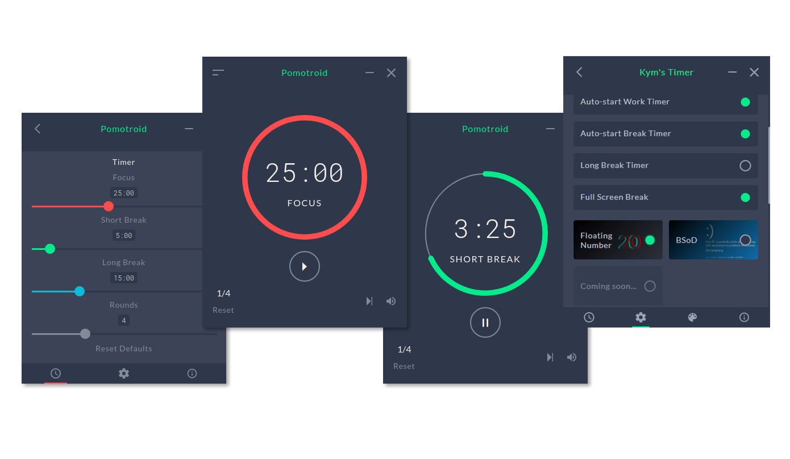

<div align="center">
  
</div>

---

## Overview

Kym's Timer 是一个基于[Pomotroid](https://github.com/Splode/pomotroid)简单修改的番茄钟应用，符合"3个20"护眼原则。使用Vue和Electron开发。

科学用眼的“三个二十”原则： 每隔20分钟眨眼20下或远眺20秒,可以有效缓解眼疲劳。

## Reference

[Pomotroid](https://github.com/Splode/pomotroid) 是一个制作精美的番茄钟应用，并且支持多种主题，此项目基于v0.13.0开发。
## Modified

- 修改Short Break为秒钟
- 增加Long Break选择开关
- 增加全屏提醒

## Development


```bash
# install dependencies
npm i

# serve with hot reload at localhost:9080
npm run dev

# build Pomotroid for production
npm run build
```

## Bugs

- 蓝屏程序固定运行20s，不能和休息时间匹配
- 继承Pomotroid的Bug

## Roadmap

- 推出更多的休息时界面
- 实现一套自己风格的UI
- 必不可少的图表